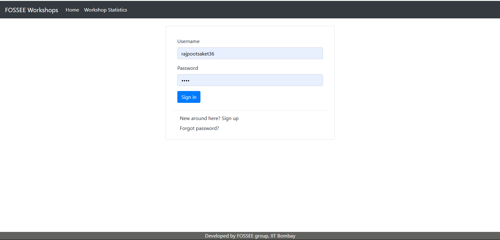
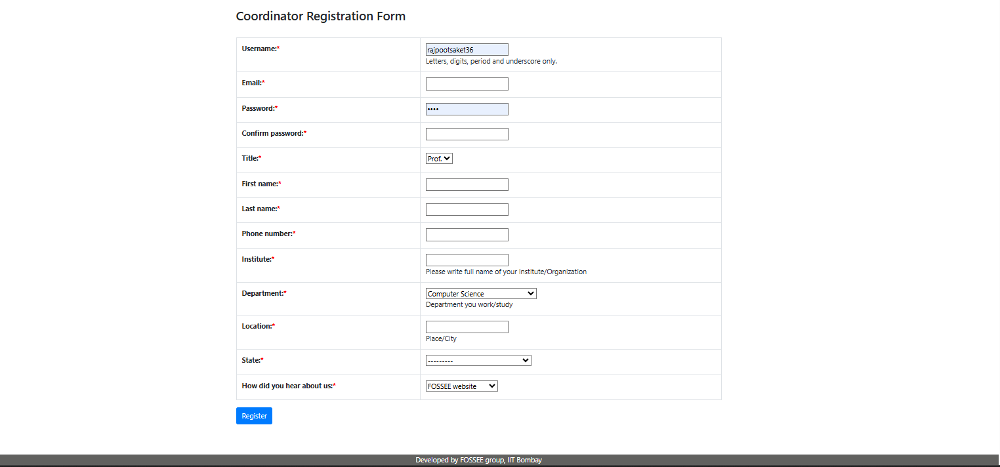
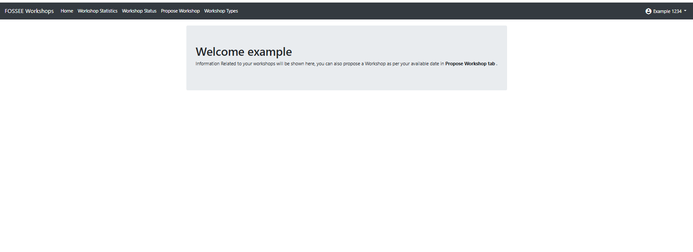
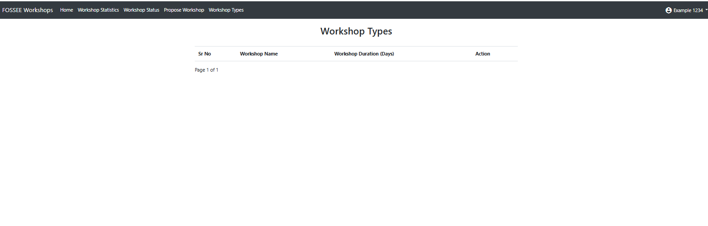
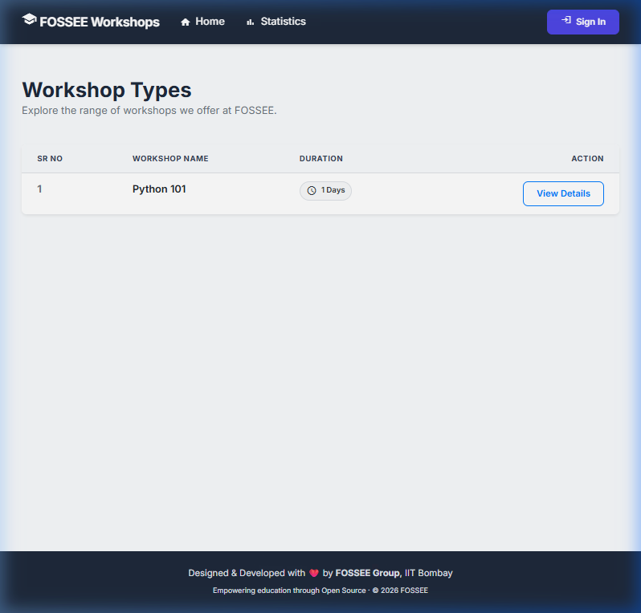
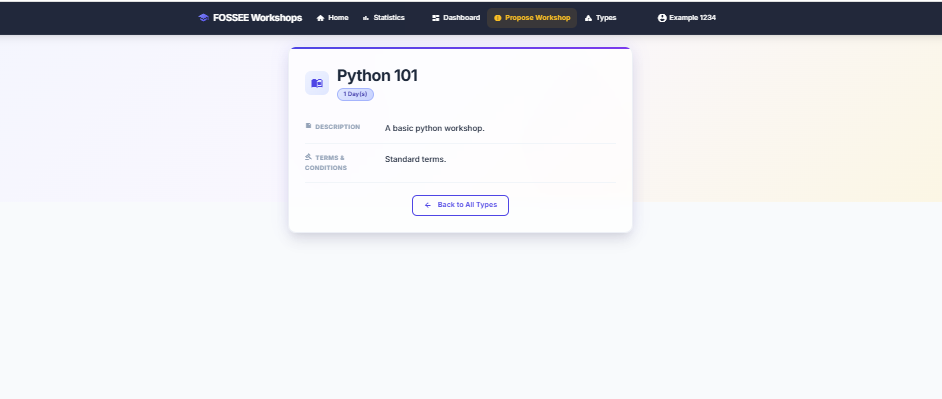
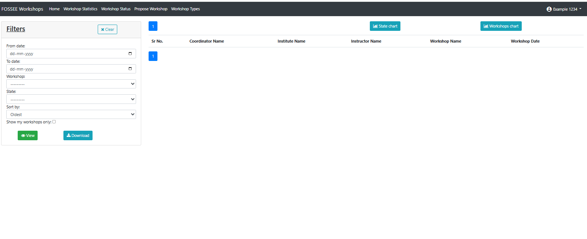
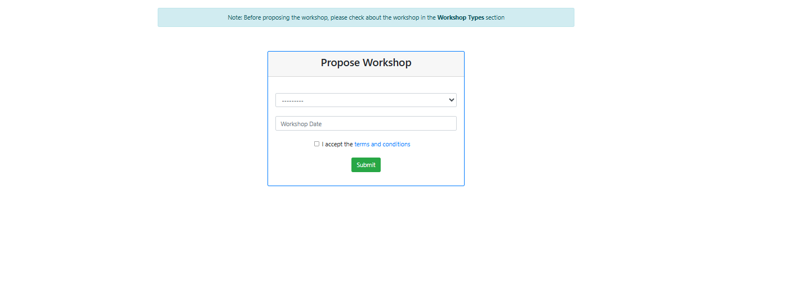
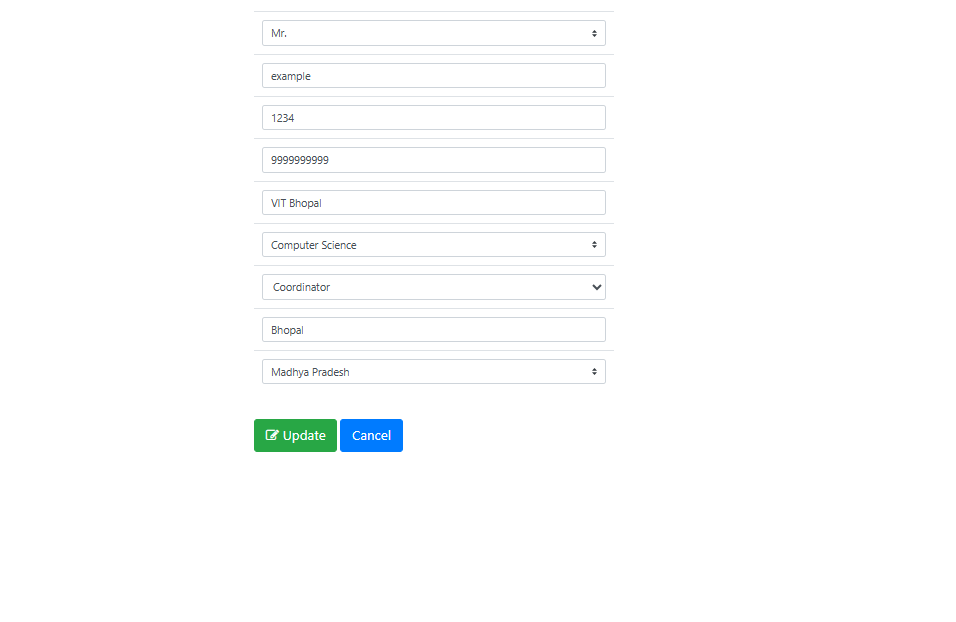
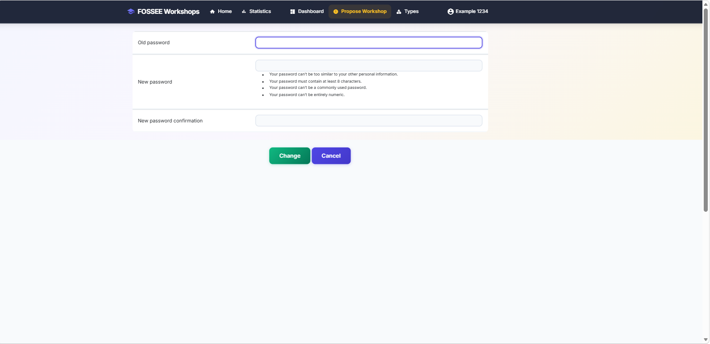

# 🚀 FOSSEE Workshop Booking — UI/UX Enhancement

> A **human-centered, mobile-first redesign** of the FOSSEE Workshop Booking System using **React (CDN)** and **Modern CSS**, while keeping the **Django backend completely unchanged**.

---

## 📌 Project Objective

This project focuses on improving **real student experience**, not just UI.

* Improve usability for **mobile-first users**
* Maintain **backend integrity (zero changes)**
* Apply **modern frontend practices without build tools**
* Deliver a **clean, production-like experience**

---

## ❗ Problem Statement

The existing system had several usability issues:

* ❌ Table-heavy, outdated interface
* ❌ Poor mobile responsiveness
* ❌ Weak visual hierarchy
* ❌ Minimal interactivity

👉 Result: Users struggled with navigation and task completion.

---

## 💡 Solution Approach

A **layered, non-intrusive architecture** was used:

```
Django Templates (Structure - unchanged)
        ↓
Modern CSS Design System (Visual Layer)
        ↓
React (CDN) Components (Interactive Layer)
```

✔ No backend modification
✔ No build tools required
✔ Progressive enhancement approach

---

## 🎨 Key Improvements

### 1. Mobile-First Design

* Optimized for **student usage on phones**
* Tables redesigned into **card-based layouts**
* Added **bottom navigation for accessibility**

### 2. Strong Visual Hierarchy

* Clear typography and spacing
* Important actions highlighted using **CTA buttons**

### 3. Scalable Design System

* CSS variables for:

  * Colors
  * Spacing
  * Shadows
  * Typography

👉 Ensures consistency across all pages

### 4. Accessibility (WCAG Inspired)

* Focus indicators (`:focus-visible`)
* ARIA roles
* Reduced motion support

### 5. Interactive Enhancements

* Password strength meter
* Search & filter functionality
* Scroll-to-top button
* Form validation

👉 Implemented without breaking Django forms

---

## ⚡ Performance Considerations

| Decision       | Benefit           | Trade-off            |
| -------------- | ----------------- | -------------------- |
| React via CDN  | No setup needed   | Slight load increase |
| CSS animations | Smooth UI         | GPU usage            |
| Google Fonts   | Better typography | Extra request        |

👉 Optimizations:

* `display=swap`
* Minimal JavaScript usage
* Hardware-accelerated animations

---

## 🧩 Challenges & Solutions

### 🔴 React + Django Integration

Django renders server-side HTML, while React manages interactivity.

**Solution:**

* Used mount points
* React acts as enhancement layer (not replacement)

---

### 🔴 CSS Conflicts with Bootstrap

**Solution:**

* Scoped styles with CSS variables
* Avoided overuse of `!important`

---

### 🔴 Backend Integrity Constraint

**Solution:**

* No changes in:

  * `views.py`
  * `models.py`
  * `forms.py`

👉 Fully compliant with task requirements

---

## 🏗️ Architecture Highlights

* Progressive Enhancement Approach
* Works even without JavaScript
* React used only where necessary

---

## 📸 Live Application Visuals (Before & After)

### 🔐 Login Page

|                           Before                          |                 After                |
| :-------------------------------------------------------: | :----------------------------------: |
|  |  |

### 📝 Registration Page

|                              Before                             |                    After                   |
| :-------------------------------------------------------------: | :----------------------------------------: |
|  |  |

### 🏠 Home Page

|                       Before                       |                  After                  |
| :------------------------------------------------: | :-------------------------------------: |
|  |  |

### 🧩 Workshop Types

|                        Before                       |                 After                |
| :-------------------------------------------------: | :----------------------------------: |
|  |  |

### 📄 Workshop Details

|                        Before                       |                       After                       |
| :-------------------------------------------------: | :-----------------------------------------------: |
|  |  |

### 📊 Public Statistics

|                          Before                          |                   After                   |
| :------------------------------------------------------: | :---------------------------------------: |
|  |  |

### 📋 Dashboard (Coordinator)

|                       Before                       |                     After                    |
| :------------------------------------------------: | :------------------------------------------: |
|  |  |

### ➕ Propose Workshop

|                         Before                        |                   After                  |
| :---------------------------------------------------: | :--------------------------------------: |
|  |  |

### 👤 Profile Page

|                         Before                        |                   After                  |
| :---------------------------------------------------: | :--------------------------------------: |
|  |  |

### 🔑 Password Change

|                      Before                     |                       After                       |
| :---------------------------------------------: | :-----------------------------------------------: |
|  |  |

---

## 📊 Impact

| Area             | Before  | After     |
| ---------------- | ------- | --------- |
| Mobile usability | Poor    | Excellent |
| UI clarity       | Low     | High      |
| Interactivity    | Minimal | Improved  |
| Accessibility    | Limited | Better    |

---

## ⚙️ Setup Instructions

Follow these steps to run the project locally:

```bash
git clone https://github.com/your-username/fossee-workshop-ui-enhancement.git
cd fossee-workshop-ui-enhancement
pip install -r requirements.txt
python manage.py runserver
```

Open your browser and go to:

[http://127.0.0.1:8000/workshop/login/]

---

## 🚀 Future Scope

* Analytics Dashboard
* Advanced Search & Filters
* Recommendation System
* Progressive Web App (PWA) support

---

## 🛠️ Tech Stack

* Backend: Django
* Frontend: React (CDN)
* Styling: Modern CSS
* Icons: Material Icons

---

## 🏆 Why This Stands Out

* No backend modification
* Real-world usability focus
* Clean, scalable design
* Progressive enhancement approach

👉 This is not just a redesign — it is a **product-level improvement**.

---

## 👨‍💻 Author

**Shaket Singh Rajpoot**
B.Tech CSE, VIT Bhopal

---

## ❤️ Final Note

> "Good UI looks clean.
> Great UI solves real problems.
> This project focuses on real student needs."
