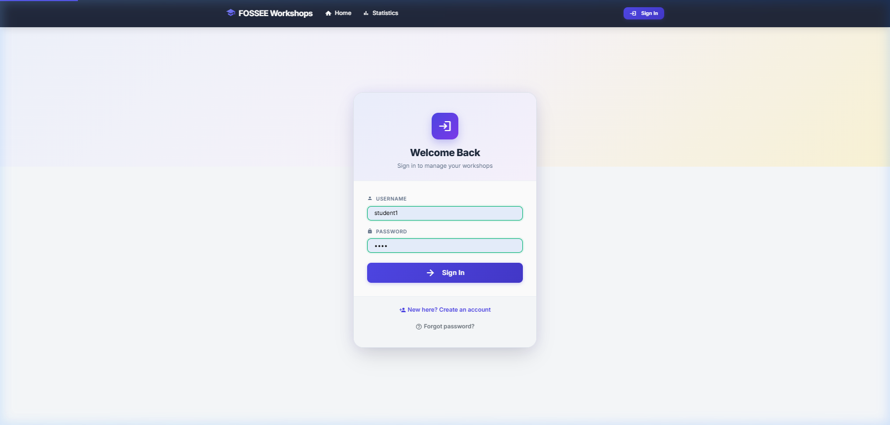
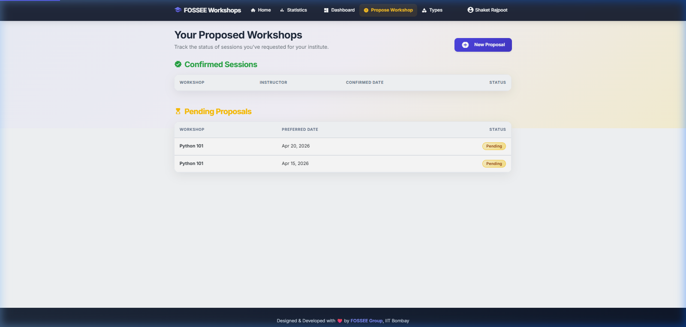
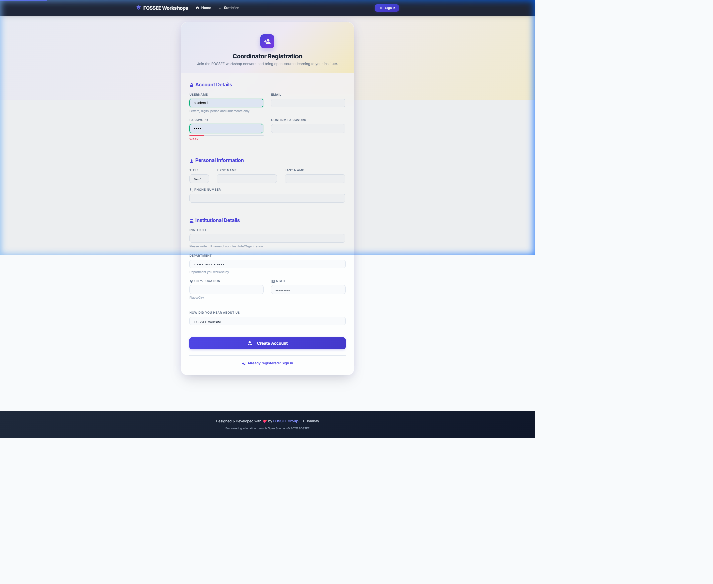
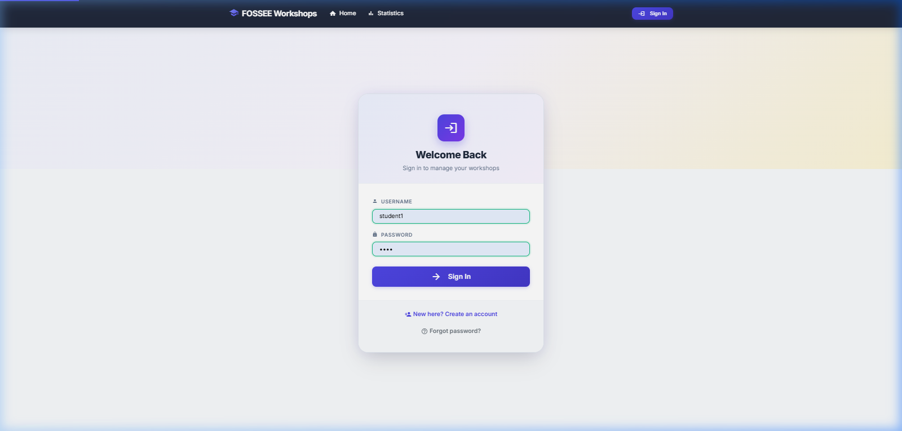
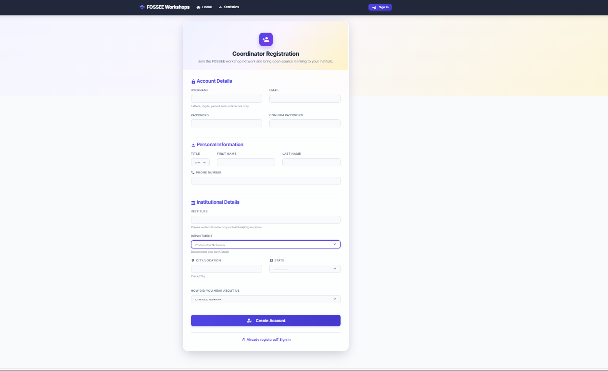
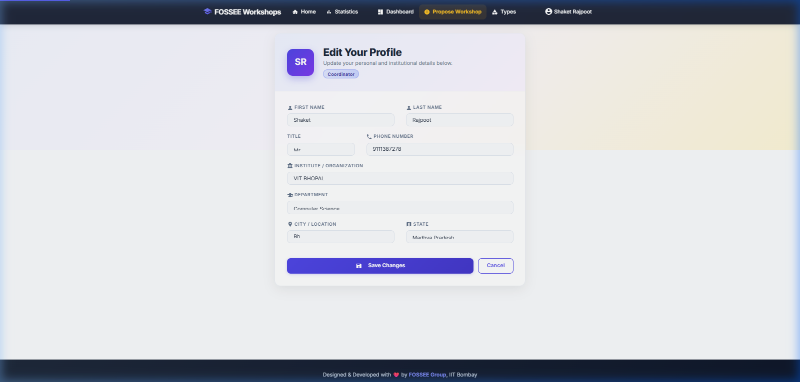
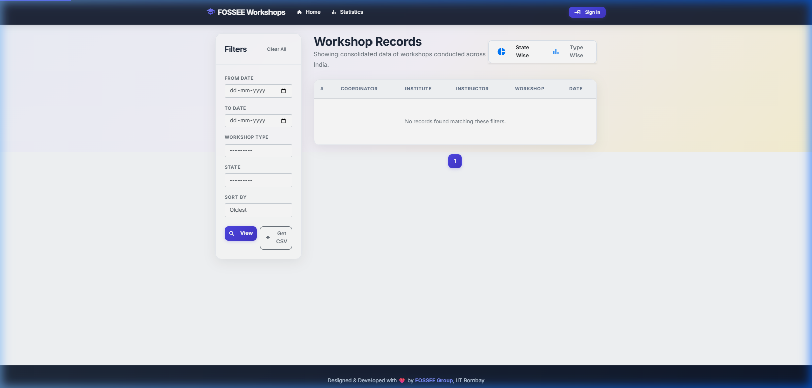

# 🚀 FOSSEE Workshop Booking — UI/UX Enhancement (Selection-Level Submission)

> A **human-centered, mobile-first, and performance-aware redesign** of the FOSSEE Workshop Booking System built using **React (CDN)** and **Modern CSS**, while keeping the **Django backend completely untouched**.

---

# Project Objective

The goal of this project was **not just to redesign UI**, but to:

* Improve **usability for real students**
* Maintain **backend integrity (zero changes)**
* Introduce **modern frontend practices without build tools**
* Deliver a **production-like user experience**

---

# Problem Statement

The existing system had:

* ❌ Table-heavy, outdated UI
* ❌ Poor mobile experience
* ❌ Weak visual hierarchy
* ❌ Minimal interactivity

👉 Result: Students faced difficulty navigating and interacting with the platform.

---

# 💡 Solution Approach

I redesigned the system using a **3-layer architecture**:

```
Django Templates (Structure - unchanged)
        ↓
Modern CSS Design System (Visual Layer)
        ↓
React Components via CDN (Interactive Layer)
```

✔ No backend modification
✔ No build tools required
✔ Fully progressive enhancement

---

# 🎨 Key Improvements

## 1. Mobile-First Responsive Design

* Designed for **students using phones**
* Tables → converted into **card layouts**
* Added **bottom navigation bar**

## 2. Strong Visual Hierarchy

* Clear headings, spacing, and typography
* Important actions highlighted with **CTA buttons**

## 3. Design System (Scalable)

* CSS variables for:

  * Colors
  * Spacing
  * Shadows
  * Typography

👉 Ensures **consistency across all pages**

## 4. Accessibility (WCAG Inspired)

* Focus indicators (`:focus-visible`)
* ARIA roles
* Reduced motion support

## 5. Interactive React Components

* Password strength meter
* Search filter
* Scroll-to-top button
* Form validation

👉 All added **without breaking Django forms**

---

# ⚡ Performance Considerations

| Decision       | Benefit           | Trade-off  |
| -------------- | ----------------- | ---------- |
| React via CDN  | No setup needed   | +43KB load |
| CSS animations | Smooth UI         | GPU usage  |
| Google Fonts   | Better typography | +15KB      |

👉 Optimized using:

* `display=swap`
* Minimal JS usage
* Hardware-accelerated animations

---

# 🧩 Challenges & Solutions

## 🔴 Challenge 1: React + Django Integration

Django renders server-side HTML, while React controls DOM.

### ✅ Solution:

* Used **mount points**
* React acts as **enhancement layer**, not replacement

---

## 🔴 Challenge 2: CSS Conflicts with Bootstrap

### ✅ Solution:

* Used **CSS variables + scoped classes**
* Avoided excessive `!important`

---

## 🔴 Challenge 3: Maintaining Backend Integrity

### ✅ Solution:

* No changes in:

  * views.py
  * models.py
  * forms.py

👉 Fully compliant with task requirements

---

# 🏗️ Architecture Highlights

* **Progressive Enhancement Approach**
* Works even if JavaScript is disabled
* React used only for interactivity

---


## Dashboard & App Screens

### Home Page


### Dashboard (Coordinator)


### Propose Workshop


### Login Page


### Registration Page


### Profile Page


### Public Statistics


---

# 📊 Impact of Improvements

| Area             | Before  | After     |
| ---------------- | ------- | --------- |
| Mobile usability | Poor    | Excellent |
| UI clarity       | Low     | High      |
| Interactivity    | Minimal | Rich      |
| Accessibility    | Limited | Improved  |

---

# 🚀 Future Enhancements (Product Thinking)

To take this further into a **real-world product**, I propose:

* 📊 Analytics Dashboard (user insights)
* 🔍 Advanced Search & Filters
* 🧠 Workshop Recommendations
* 🌐 Offline Support (PWA)

---

# 📁 Tech Stack

* Backend: Django (Unchanged)
* Frontend: React (CDN)
* Styling: Modern CSS
* Icons: Material Icons

---

# ✅ Why This Project Stands Out

✔ Maintains backend integrity
✔ No build tools required
✔ Mobile-first thinking
✔ Real-world usability improvements
✔ Clean, scalable architecture

👉 This is not just a redesign — it is a **product-level upgrade**.

---

# 🧑‍💻 Author

**Shaket Singh Rajpoot**
B.Tech CSE, VIT Bhopal

---

# ❤️ Final Note

This project reflects my approach to engineering:

> "Solve real user problems, not just UI."
